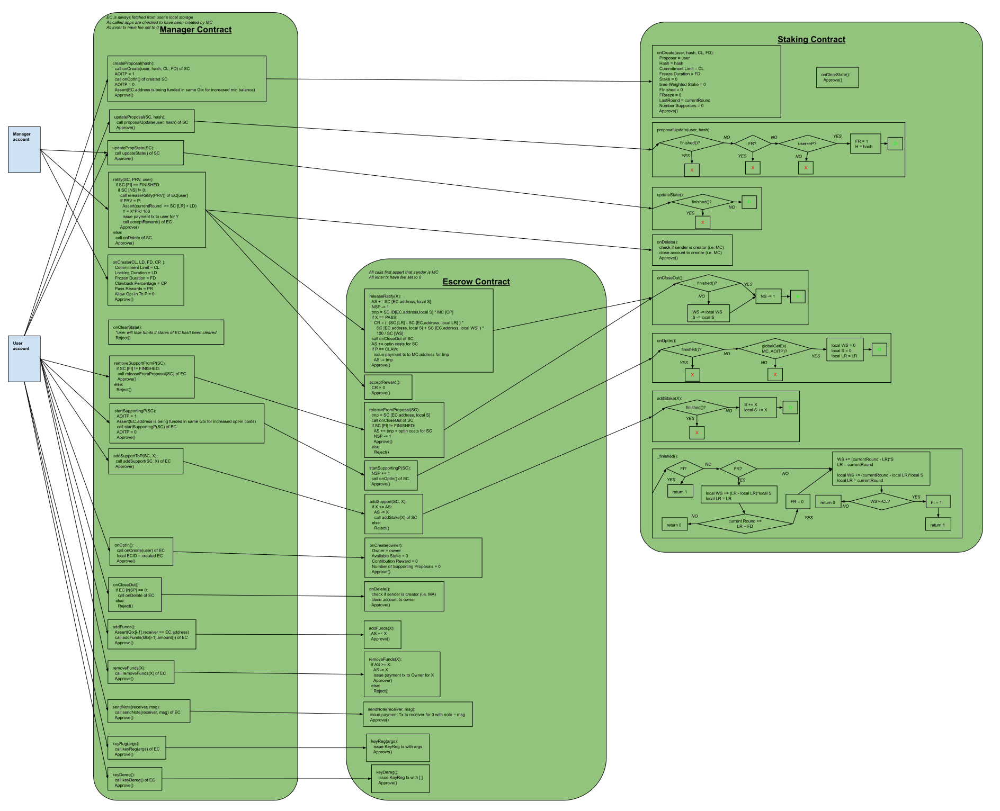
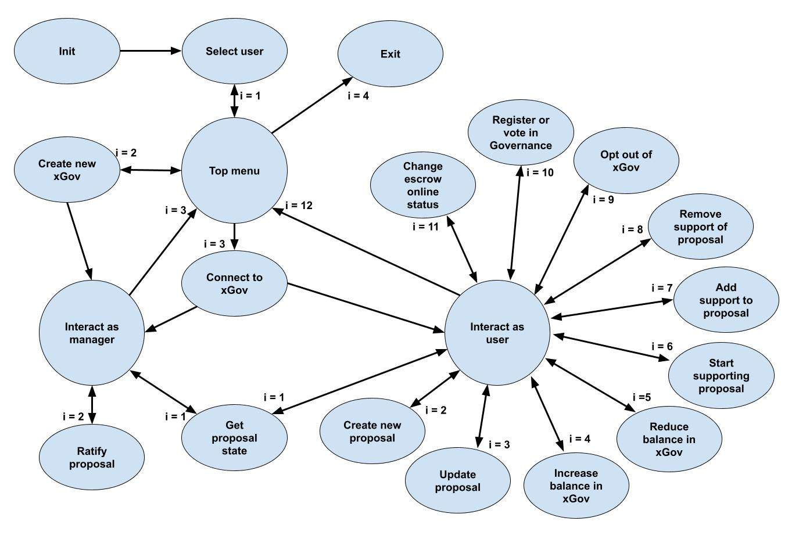

# Initiative Referendums - Alternative Implementation of xGov

This project provides an implementation for how Algorand community can put measures up to a general vote in 
[Algorand Governance](https://governance.algorand.foundation/), i.e. it provides a possible implementation 
of [xGov system](https://www.algorand.foundation/news/xgov-expert-governors-system).
The implementation follows how [initiative referendums](https://en.wikipedia.org/wiki/Referendum#Optional_referendum) 
work in democracy, i.e. a citizen-led process to propose a new law. The law first needs to gather sufficient initial 
support by the voting body before it is put to a general vote to the whole body.
Similar approaches are already used in various blockchains, e.g. as in 
[Cosmos ecosystem](https://hub.cosmos.network/main/governance/process.html).
Existing implementations require that a certain commitment limit in terms of committed stake must be reached before a 
proposal is put to the general vote. Multiple parties can contribute towards reaching the commitment limit.
The [xGov system](https://www.algorand.foundation/news/xgov-expert-governors-system) expands on that concept by 
stipulating that in order to put a proposal to a vote:
1) The commitment to the proposal needs to be maintained for a sufficient amount of time, 
2) A higher stake needs to be committed than for simply voting,
3) Experience in the ecosystem needs to be aggregated, and
4) anti-spamming measures need to be put in place.

The solution presented in this project fulfills these requirements by implementing a platform where anyone can create a 
proposal and gather support towards the commitment limit.

To fulfill the requirement (3) of experience aggregation, the commitment limit is changed from a stake commitment 
(i.e. number of tokens) to a time-weighted stake commitment (i.e. aggregation of number of tokens committed each 
round/block).
This mechanism also helps to fulfill the requirement (1),
which is expanded further by allowing the platform to be configured in a way to lock the initial stake that supported a 
passed proposal for a certain duration after it has been accepted.
This gives the option to ensure the initial proposal supporters live with the consequence of the accepted proposal. 
The anti-spamming requirement (4) is ensured by not only having the option to set the commitment limit to a high enough 
value but also having the option to enable seizing a part of the initial supporters' stake if the general vote decides 
the proposed measure to be malicious or spam (i.e. vetoed).
All these requirements inherently increase the commitment required by the proposal supporters than for simply voting 
(2).
Since Algorand Governance currently provides rewards for participation, the platform also gives the option to reward 
supporters of an accepted proposal. 
This can be used to incentivize creation of high-quality proposals.
The supporters are rewarded based on the share of their contribution towards reaching the time-weighted commitment
limit.

These ideas have already been suggested and discussed on Algorand Forum - 
[here](https://forum.algorand.org/t/counterproposal-to-xgov/6035) and 
[here](https://forum.algorand.org/t/evolving-algorand-governance/6646/176). However, to the best of the author's 
knowledge, these ideas have not been implemented up to now. Hence, this project provides a novel addition to the 
Algorand Governance and its ecosystem.  

# Platform Architecture and Functionality

The platform consists of 3 types of smart contracts:
[Manager Contract](src/ManagerContract.py), 
[Escrow Contract](src/EscrowContract.py), and 
[Staking Contract](src/StakingContract.py).
These contracts interact with one another as shown in figure below to provide the functionality described in more 
detail further on. The figure depicts only the core logic performed by each contract call.

The [Manager Contract](src/ManagerContract.py) contract oversees all platform's functionality.
It is created by a manager account (i.e. by the Algorand Foundation), which defines the parameters of the platform like
commitment limit, reward amounts, locking duration for funds supporting an accepted proposal, amount of funds seized
in case a proposal is decided by the general voted to be malicious or spam, etc.
The manager account does not have the option of participating by creating or supporting proposals as other users.
The manager's role is to oversee which proposals have reached the commitment limit, and thus must be put to a 
general vote.
After the general vote on the proposal, the manager ratifies the outcome of the vote, i.e. triggering e.g. 
reward distribution if the proposal passed or seizing of funds if the proposal was vetoed. Note that this centralized 
source of power is necessary because Algorand Governance is not (yet) implemented fully on-chain.

Users opt-in to the contract, which creates an escrow account for them - controlled by the 
[Escrow Contract](src/EscrowContract.py).
The user can then deposit funds to the escrow account to use them for supporting their own or others proposals to reach
the commitment limit.
The user can select which proposals one would like to support as well as to assign a supporting stake to each of them.
The user can increase the stake with which one supports a proposal or remove one's existing contribution towards 
reaching the time-weighted commitment limit.
The latter is possible only as long as the proposal has not yet reached the limit.
After the limit is reached, the stake is locked until the manager ratifies the outcome of the proposal.
At anytime, the user can withdraw any funds from the escrow account that have not been committed towards support of a 
proposal.
So that the user's funds do not simply idly sit in the escrow account, the user can use that stake to commit it to
Algorand Governance, i.e. to vote with it on the outcome of the proposals put to the general vote.
Moreover, the user can bring the escrow account online to have the stake participate in Algorand consensus, helping to 
secure the chain.

Each user can also make a Governance proposal, which creates a [Staking Contract](src/StakingContract.py).
During the creation, the proposer submits a hash of the proposal, which gets stored in the contract.
Other users can then decide to start supporting the proposal by committing a portion of one's stake from the escrow 
account. 
Note that the proposer itself does not automatically start supporting its won proposal but can do so if one chooses.
At anytime, the initial proposer can decide to update the proposal, e.g. after getting feedback from supporters.
When updating the proposal, the proposer sends a hash of the updated proposal, which gets stored in the contract.
This action triggers a freeze on the proposal's progress towards the time-weighted commitment limit.
The freeze duration (which is defined by the platform manager at the platform creation) gives existing supporters the 
option to (re)consider whether one would like to continue supporting the proposal (with the same or different stake) or 
perhaps remove their contribution towards the time-weighted commitment limit if they do not agree with the updated 
proposal anymore.
Nobody but the initial proposer can update the proposal.
The proposal remains live on the platform until it has reached the commitment limit 
and the outcome of the vote has been ratified. Afterwards, the proposal contract is deleted from the platform.   

# Demo Interactions with the Platform

The project includes a [script for interacting with the platform](interaction_state_machine.py) through a simple 
command-line interface.
The script implements the state machine shown in figure below.

An example scenario of interactions with the platform through the provided interaction 
[script](interaction_state_machine.py) has been recorded and the
[video excerpts](demo/README.md) documented.

To test the platform with the provided [script](interaction_state_machine.py), the following is required:
- Python (>=3.10) with libraries in [requirements.txt](requirements.txt), 
which can be installed using `pip install -r requirements.txt`
- Connection to an Algorand node and indexer (e.g. [Sandbox](https://github.com/algorand/sandbox) or 
publicly available nodes by [AlgoExplorer](https://algoexplorer.io/) 
https://node.testnet.algoexplorerapi.io and https://algoindexer.testnet.algoexplorerapi.io/)
- One or more mnemonics stored in plain text in .txt files (with spaces as delimiters)
*<= This is for simplicity of testing only!*
- Funding for the accounts. If using Algorand Testnet, test ALGO can be received at
https://testnet.algoexplorer.io/dispenser

For testing the platform, clone the repository and run the provided [script](interaction_state_machine.py).

# Roadmap

1) **Extend math operations onto 128 bits**: Math operations are currently done on 64 bits. This allows setting the 
commitment limit to 40 M ALGO per quarter as suggested
[here](https://forum.algorand.org/t/evolving-algorand-governance/6646/176#protocol-parameters-4).
However, to allow arbitrary large commitments and duration combinations as well as non-integer percentage for parameter 
for seizing funds, it would be prudent to switch to 128 bit operations to prevent overflows.

2) **Smart contract optimization**: Improve code re-usage and remove redundant checks to decrease smart contract size,
thus lower the opt-in costs

3) **Modifiable platform parameters by the manager**: e.g. allow change of commitment limit, locking duration, 
and freeze duration at an already deployed platform if a Governance vote decides to change these parameters.

4) **User-friendly interface**: to be integrated with Algorand Governance portal, displaying all active proposals 
together with their content (not just hash), simplified and secure interactions with the platform (i.e. wallet 
integration), etc.

5) **Integration with fully on-chain Governance**: i.e. on-chain scheduling of a vote after a proposal reaches the 
commitment limit as well as subsequent ratification of the outcome of the vote.

# Notice

The project was developed during [Algorand Greenhouse Hack #2](https://gitcoin.co/hackathon/greenhouse/onboard) 
and submitted to [Bring Your Own Project (BYOP)](https://gitcoin.co/issue/29368) category.

The smart contracts are written in [PyTEAL](https://github.com/algorand/pyteal) and 
are [ABI compliant](https://developer.algorand.org/docs/get-details/dapps/smart-contracts/ABI/).
The command-line interface is written in Python and uses the 
[py-algorand-sdk](https://github.com/algorand/py-algorand-sdk).

The software is not meant for production deployment - the smart contracts have not been audited and the provided 
test user interface does not follow the recommended security guidelines regarding handling of mnemonics.

Author: Uroš Hudomalj - https://github.com/uhudo
